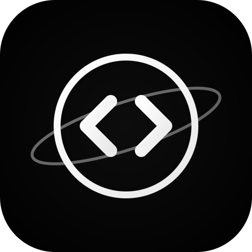
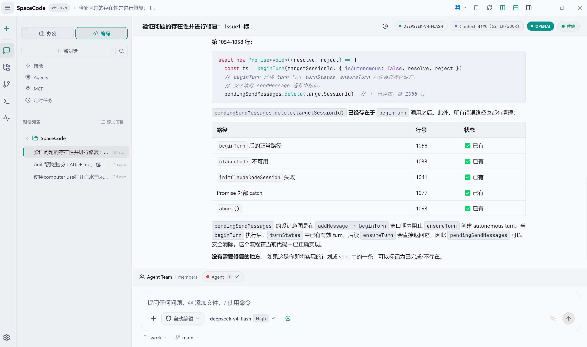
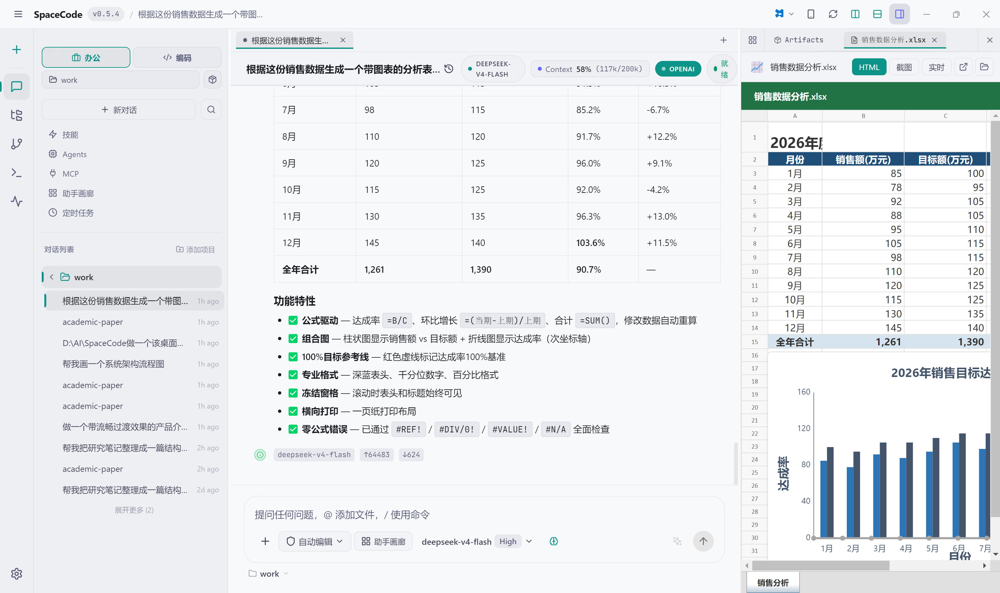
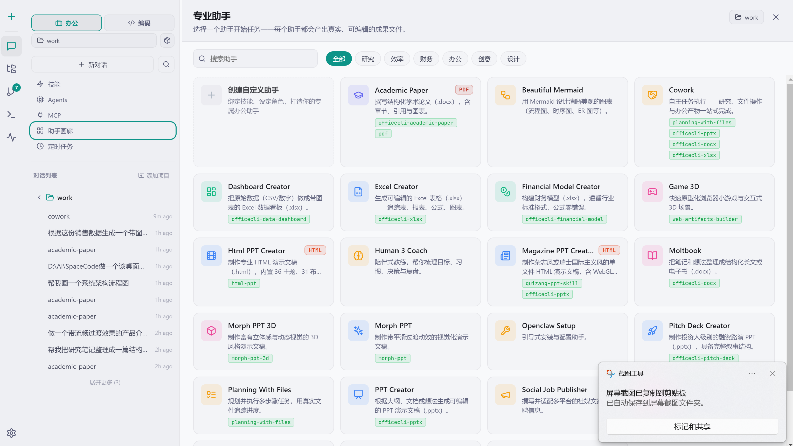
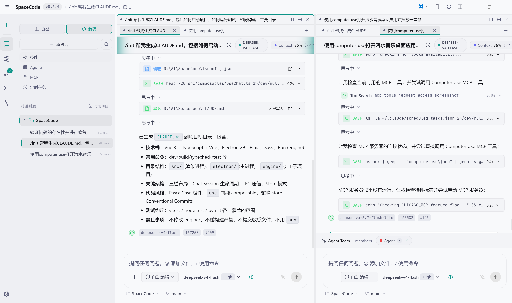

<div align="center">



# SpaceCode

### AI 驱动的智能编程桌面助手

基于 Claude Code 引擎构建的新一代 AI 辅助编程桌面应用，深度融合大语言模型能力，为开发者提供智能化的代码编写、调试、重构和项目管理体验。

[](https://www.electronjs.org/)
[](https://vuejs.org/)
[](https://vitejs.dev/)
[](https://www.typescriptlang.org/)
[](https://bun.sh/)
[]()

[多模式核心](#多模式核心) · [Computer Use](#-computer-use桌面控制) · [Browser Use](#-browser-use浏览器自动化) · [更多特色](#更多特色) · [快速开始](#快速开始) · [项目结构](#项目结构) · [开发指南](#开发指南) · [技术栈](#技术栈)

</div>

---

## 项目简介

SpaceCode 是一款跨平台 AI 桌面助手，采用 **Electron + Vue 3 + TypeScript** 技术栈构建。它创造性地将 **AI 编程** 与 **AI 办公** 融合到同一应用中，通过顶部的 `💻 编码` / `💼 办公` 模式切换，在一款工具中同时满足开发者的代码编写需求和职场人的文档产出需求。

项目采用 Monorepo 架构，包含桌面 GUI 应用（根目录）、CLI 核心引擎（`engine/`）和 Flutter 移动端配套应用（`mobile-app/`），支持扫码配对远程协作。

---

## 多模式核心

SpaceCode 的核心是 **编码模式**、**办公模式** 和 **设计模式** 三大场景，通过顶部 Tab 一键切换，共享会话管理、多模型支持、技能系统等底层能力。

### 💻 编码模式（Code Mode）

面向开发者的 AI 编程助手，深度集成 Claude Code 引擎，提供从代码编写、调试、重构到项目管理的全流程辅助。

<div align="center">



*编码模式：三栏 IDE 布局，AI 对话 + 工具调用卡片 + 文件树/Diff 面板*

</div>

**核心能力：**

| 能力 | 说明 |
|------|------|
| **AI 对话编程** | 自然语言描述需求，AI 自动读写文件、执行命令、生成代码 |
| **工具调用卡片** | Bash、Edit、Read、Write、Glob、Grep、WebFetch、WebSearch、Agent 等 13+ 工具的可视化卡片，每步操作清晰可见 |
| **代码 Diff 预览** | 基于 `@git-diff-view` 的行级差异对比，AI 每次编辑都可审查 |
| **集成终端** | 基于 xterm.js + node-pty，支持多终端标签页，与 AI 会话无缝协作 |
| **Git SCM 面板** | 暂存、提交、推送、分支管理、Diff 查看，事件驱动自动刷新 |
| **文件浏览器** | 项目树状导航，支持右键菜单与外部编辑器打开（VS Code、Cursor、Vim 等） |
| **对话回滚（Rewind）** | 支持将对话和代码变更回滚到历史消息节点，提供 4 种回滚策略 |
| **权限控制** | 自动批准 / 手动批准 / 始终拒绝 / 仅建议四种模式，精细控制 AI 操作范围 |
| **斜杠命令** | 内联命令芯片 + 斜杠命令菜单，70+ 命令覆盖常用操作 |

**对话回滚策略：**

| 策略 | 说明 | 适用场景 |
|------|------|----------|
| 回滚对话和代码 | 删除目标消息后的所有消息并撤销代码更改 | 彻底回退到某个决策点 |
| 仅回滚对话 | 仅删除对话记录，保留代码变更 | 换种方式重新提问 |
| 仅回滚代码 | 仅撤销代码更改，保留对话上下文 | 代码改错了但想保留上下文 |
| 回滚并总结 | 回滚后生成变更总结 | 团队协作记录回滚原因 |

### 💼 办公模式（Work Mode）

面向职场场景的 AI 办公助手，内置 20+ 专业助手，能够直接生成可编辑的 `.pptx`、`.docx`、`.xlsx` 文件，而非输出 Markdown 让用户自行排版。

<div align="center">



*办公模式：办公助手快捷入口 + AI 对话 + 产物汇总卡片 + 文档实时预览*

</div>

**核心能力：**

| 能力 | 说明 |
|------|------|
| **专业办公助手** | 内置 PPT 制作、Word 文档、Excel 表格、财务模型、数据看板、学术论文等 20+ 专业助手 |
| **真实文件产出** | 通过 officecli 技能体系直接生成可编辑的 `.pptx`/`.docx`/`.xlsx` 文件，支持下载后二次编辑 |
| **产物汇总卡片** | 每轮对话自动收集和展示生成的文件，支持预览、打开、定位文件夹 |
| **文档实时预览** | 右侧面板支持 HTML 渲染、截图缩略图、实时观看三种预览模式 |
| **自定义助手** | 支持创建自定义办公助手，配置系统提示词、技能绑定与推荐 Prompt |
| **officecli 技能体系** | 全量接入 officecli 技能库，涵盖 PPT 多套样式、Word 表单、Excel 数据看板等场景 |
| **工作空间管理** | 首次进入办公模式引导选择工作目录，所有产物统一存放在 `outputs/` 目录 |

**内置助手一览：**

| 分类 | 助手示例 |
|------|----------|
| 📊 演示文稿 | PPT 制作、Morph PPT、Morph PPT 3D、融资路演 Pitch Deck |
| 📄 文档写作 | Word 文档、Word 表单、文档协作 |
| 📈 数据表格 | Excel 表格、数据看板 |
| 🎓 学术研究 | 学术论文、财务模型 |
| 🎨 创意设计 | UI/UX 设计、品牌指南、社交图片 |
| ⚡ 通用效率 | 文件规划、TDD 指导、代码审查 |

<div align="center">



*办公助手画廊：20+ 专业助手，按分类筛选，支持自定义创建*

</div>

### 🎨 设计模式（Design Mode）

面向 UI/UX 设计与前端原型的 AI 设计工作台，深度复刻 open-design 交互范式，让 AI 在结构化对话中完成设计系统分析、视觉方向探索与可交付产物生成。

**核心能力：**

| 能力 | 说明 |
|------|------|
| **设计系统选择器** | 浏览、搜索与预览 open-design 设计系统，支持官网链接跳转与 Token 色板解析 |
| **模板选择器** | 按场景筛选设计模板，悬停展示能力详情，一键切换会话设计方向 |
| **设计对话面板** | 专用 DesignChatPane + DesignComposer 输入框，模板、工作目录与快捷操作内置在聊天输入区域 |
| **文件工作区** | DesignFileWorkspace 支持多 tab、源码预览与导出，设计产物集中管理 |
| **结构化设计卡片** | OdCard 组件支持 brand、direction、artifact、generic 四种类型，设计结论可视化呈现 |
| **设计系统导出** | 一键导出设计系统为展示页面，支持 Markdown 安全渲染与 XSS 过滤 |
| **工作目录选择器** | WorkingDirectoryPicker 快速指定设计产物存放位置，支持 inline 紧凑模式 |

**工作流程：**

1. 切换到设计模式，选择目标设计系统与设计模板
2. 在 DesignComposer 中描述设计需求或上传参考
3. AI 通过 od-card、question-form、next-steps 等结构化卡片推进设计
4. 在设计文件工作区中预览、编辑并导出最终产物

<div align="center">

*设计模式：AI 驱动的 UI/UX 设计工作台，从方向探索到产物交付*

</div>

---

## 更多特色

### 🖥️ 分屏多会话布局

- **三栏式 IDE 布局**：侧边栏 + 聊天面板 + 信息面板，灵感来自 VSCode，支持拖拽调整面板宽度
- **分屏多会话**：中央区分屏布局系统，支持多会话并行展示，每个标签页独立管理
- **浏览器式 Tab 管理**：类似 Chrome 的标签页管理，新建、切换、关闭一气呵成
- **后台会话保持**：关闭 Tab 不会终止后台进程，任务继续运行
- **进程池管理**：多 CLI 进程并发，LRU 策略自动暂停最久未用的会话

<div align="center">



*分屏多会话：多个会话标签并行运行，各自独立管理*

</div>

### 🖥️ Computer Use（桌面控制）

SpaceCode 深度集成了 [cua-driver](https://github.com/trycua/cua) —— 基于 Rust 的跨平台 Computer-Use 驱动，让 AI 能够**在后台直接操控桌面应用**，而不会抢占你的鼠标光标或键盘焦点。

**核心亮点：**

| 能力 | 说明 |
|------|------|
| **后台桌面操控** | AI 可执行截图、点击、输入文字、滚动、拖拽等操作，真实 OS 光标始终不动，你的工作不被打断 |
| **无障碍树精准定位** | 通过 AX / UIAutomation / AT-SPI 无障碍树获取编号元素覆盖层，AI 按元素索引点击，远比像素坐标精准 |
| **跨平台支持** | macOS（SkyLight SPI）、Windows（UIAutomation + SendInput）、Linux（AT-SPI + XTest）三端原生驱动 |
| **二进制自动管理** | 支持内置打包二进制（离线秒装）、系统 PATH 检测、GitHub 在线安装（含镜像加速），多级回退策略 |
| **macOS 权限管理** | 可视化查询与请求辅助功能（Accessibility）和屏幕录制（Screen Recording）TCC 权限 |
| **健康诊断面板** | 一键运行 cua-driver 诊断矩阵，检查二进制版本、平台支持、无障碍能力、屏幕捕获等各项指标 |
| **自动更新检测** | 对比已安装版本与 GitHub 最新 Release，提示升级 |
| **25+ MCP 工具** | 截图、窗口枚举、鼠标/键盘操作、应用管理、会话管理、轨迹录制与回放等完整工具链 |

**双通道架构：**

- **CLI 通道**：cua-driver 作为 MCP 服务器通过 `--mcp-config` 注入 Claude Code CLI，AI 在对话中自动调用
- **主进程直连通道**：Electron 主进程通过 stdio MCP 直接通信，用于健康检查、权限管理、工具预览

**工作流程：**

1. 在设置面板「Computer Use」中一键安装 cua-driver（内置二进制秒级完成）
2. macOS 用户授权辅助功能与屏幕录制权限（Windows/Linux 无需额外权限）
3. 在对话中描述需要操作的桌面应用，AI 自动调用 cua-driver 工具
4. AI 操作前先截图分析界面，操作后再次截图验证结果

<div align="center">

*适用场景：操作原生应用、安装器、模态对话框等无法用代码控制的 GUI 界面*

</div>

### 🌐 Browser Use（浏览器自动化）

SpaceCode 内置 Browser Use 浏览器自动化能力，让 AI 能够**操控真实浏览器完成网页浏览、信息检索、表单填写、页面测试等任务**，无需人工切换窗口。

**核心亮点：**

| 能力 | 说明 |
|------|------|
| **本地与云端浏览器** | 支持本地 Chrome/Edge 浏览器驱动，也可连接 Cloud Browser 服务，按需选择执行环境 |
| **MCP 浏览器自动化** | 通过 browser-use MCP 服务器将浏览器操作暴露为标准化工具，AI 对话中自动调用 |
| **Agent 高级配置** | 支持自定义 Agent 行为、headless 模式、视口尺寸、用户代理等高级参数 |
| **桌面 LLM 配置复用** | 直接复用 SpaceCode 已配置的 LLM 提供商与模型，无需重复设置 API Key |
| **镜像源加速安装** | 内置镜像源选择，一键安装 browser-use 依赖，提升国内网络环境下的安装成功率 |
| **可视化设置面板** | 在「Browser Use」设置页中管理安装状态、选择浏览器类型、配置高级选项 |

**工作流程：**

1. 在设置面板「Browser Use」中选择本地浏览器或配置 Cloud Browser
2. 一键安装 browser-use 依赖（支持镜像源加速）
3. 在对话中描述需要完成的网页任务，AI 自动调用浏览器工具
4. AI 实时截图分析页面、执行点击/输入/滚动等操作，并返回结果

<div align="center">

*适用场景：网页数据采集、自动化测试、在线信息检索、Web 应用操作*

</div>

### 🤖 双引擎多模型架构

- **双引擎支持**：Claude Code CLI 引擎 + Pi Engine，可随时切换
- **多模型兼容**：支持 Anthropic（Claude）、OpenAI（GPT）、Gemini、Grok、DeepSeek 等主流 LLM 服务商
- **API 代理桥**：内置 Anthropic ↔ OpenAI 消息格式转换代理，支持流式响应，无缝对接 OpenAI 兼容接口
- **引擎源配置**：可视化引擎源管理，支持 CLI 自动检测与一键安装

### 🔌 MCP 协议与扩展生态

- **MCP 服务器管理**：支持 stdio / SSE / HTTP 三种传输方式，可视化配置与连通性检测
- **Computer Use MCP**：内置 `sc-computer-use` 预设，后端为 cua-driver 原生二进制，支持后台桌面操控（详见 [Computer Use](#-computer-use桌面控制) 章节）
- **Browser Use MCP**：内置 `sc-browser-use` 预设，将浏览器操作暴露为 MCP 工具，支持本地与 Cloud Browser（详见 [Browser Use](#-browser-use浏览器自动化) 章节）
- **内置 MCP 依赖安装**：一键安装与状态检测，提升环境配置体验

### 📚 技能库与智能体系统

- **50+ 内置技能**：涵盖前端设计、PPT 生成、代码审查、TDD、文档创作、办公文档等领域
- **技能管理器**：技能浏览、安装、编辑、分类过滤，支持本地技能与市场技能
- **Agents 智能体**：完整的代理管理系统，70+ 内置 Agent，支持工作流编辑与执行

### ⚡ 高级功能

- **定时任务（Cron）**：Cron 表达式解析与定时任务调度，支持任务运行日志
- **Hook 管理系统**：会话生命周期钩子，支持用户级 / 项目级 / 本地级三种作用域
- **上下文用量管理**：Token 使用量追踪、上下文缓存统计、用量可视化与预警
- **链路追踪（Trace）**：完整的会话链路追踪与调用详情查看，便于调试
- **会话上下文面板**：Git 图表、分支创建、环境变量管理、任务面板
- **迷你浏览器工作台**：内置 WebView 浏览器，支持 HTML 产物自动预览

### 📱 移动端配套

- **Flutter 跨平台应用**：支持 Android、iOS、macOS、Linux、Windows、Web 六端
- **扫码配对**：扫描桌面端二维码快速连接
- **主题实时同步**：桌面端主题配置实时同步到移动端
- **远程操作**：移动端查看会话、审批工具调用、管理代理

### 🎨 精致的用户体验

- **主题系统**：Dark / Light 双主题，Anthropic 官方配色规范，CSS 变量动态切换
- **国际化（i18n）**：完整的中英文双语支持
- **自动更新**：内置 electron-updater，支持 GitHub Release 自动检查与更新
- **快捷键系统**：可自定义的快捷键配置
- **响应式设计**：可拖拽调整面板，适配不同屏幕尺寸

---

## 快速开始

### 环境要求

| 环境 | 最低版本 | 推荐版本 | 用途 |
|------|----------|----------|------|
| **Node.js** | >= 18 | >= 20 | Desktop 构建运行 |
| **Bun** | >= 2.0.0 | >= 2.1.0 | CLI 引擎运行时 |
| **npm** | >= 9 | 最新版 | 包管理器 |
| **Git** | >= 2.x | 最新版 | 版本控制 |

### 安装与启动

```bash
# 1. 克隆项目
git clone https://github.com/hjdspace/SpaceCode.git
cd SpaceCode

# 2. 安装 Desktop 依赖（会自动安装 engine 依赖）
npm install

# 3. 启动 Electron + Vite 开发服务器
npm run electron:dev
```

启动后将同时运行 Vite 前端开发服务器（热更新）、Electron 主进程和 IPC 通信桥接层。

### 首次配置

首次启动后，在设置面板中配置 LLM 提供商：

| 配置项 | 说明 | 示例值 |
|--------|------|--------|
| Base URL | API 服务端点 | `https://api.anthropic.com/v1` |
| API Key | 认证密钥 | `sk-ant-xxxxx` |
| 快速模型 | 轻量级模型 ID | `claude-haiku-4-5-20251001` |
| 均衡模型 | 平衡型模型 ID | `claude-sonnet-4-6` |
| 高性能模型 | 旗舰模型 ID | `claude-opus-4-6` |

兼容所有 Anthropic API 规范的服务商（OpenRouter、AWS Bedrock 代理、Azure OpenAI 等），也可通过内置 API 代理桥接入 OpenAI 兼容接口。

---

## 项目结构

```
SpaceCode/
├── src/                        # Vue 3 渲染进程
│   ├── App.vue                 # 根组件（三栏布局）
│   ├── components/             # UI 组件库
│   │   ├── chat/               # 聊天组件（消息渲染、工具卡片、回滚、命令菜单）
│   │   ├── layout/             # 布局组件（分屏容器、侧边栏、标题栏、终端）
│   │   ├── explorer/           # 文件浏览器
│   │   ├── scm/                # Git 源码管理
│   │   ├── terminal/           # 终端组件
│   │   ├── settings/           # 设置面板
│   │   ├── skills/             # 技能管理
│   │   ├── agents/             # Agent 智能体管理
│   │   ├── mcp/                # MCP 配置
│   │   ├── cron/               # 定时任务
│   │   ├── work/               # 工作模式与办公助手
│   │   ├── debug/              # 链路追踪
│   │   ├── session-context/    # 会话上下文面板
│   │   └── common/             # 通用 UI 组件
│   ├── stores/                 # Pinia 状态管理（20 个模块）
│   ├── composables/            # Vue 组合式函数
│   ├── services/               # LLM 客户端、Electron API 服务
│   ├── i18n/                   # 国际化（zh-CN / en-US）
│   ├── styles/                 # 全局样式与主题变量
│   └── types/                  # TypeScript 类型定义
│
├── electron/                   # Electron 主进程
│   ├── main.ts                 # 主进程入口
│   ├── preload.ts              # Context Bridge（安全 IPC API）
│   ├── sessionProcess.ts       # 会话进程管理
│   ├── claudeCodeProcessPool.ts # 进程池管理
│   ├── cuaDriverService.ts     # cua-driver 核心服务（检测/安装/健康检查/权限）
│   ├── cuaDriverMcpClient.ts   # cua-driver MCP over stdio 客户端
│   ├── gitService.ts           # Git 操作服务
│   ├── terminalManager.ts      # PTY 终端管理器
│   ├── skillsService.ts        # 技能管理服务
│   ├── agentsService.ts        # Agent 管理服务
│   ├── cronService.ts          # 定时任务服务
│   ├── officeCliService.ts     # officecli 集成服务
│   ├── autoUpdaterService.ts   # 自动更新服务
│   ├── mobileServer.ts         # 移动端 WebSocket 服务
│   ├── proxy/                  # API 代理模块（Anthropic ↔ OpenAI 转换）
│   └── engines/                # 多引擎适配层（ClaudeCode / Pi）
│
├── scripts/
│   └── download-cua-driver.mjs # cua-driver 二进制预下载脚本（构建前运行）
│
├── engine/                     # CLI 核心引擎（Bun 独立子项目）
├── mobile-app/                 # Flutter 移动端配套应用
├── skills-lib/                 # 内置技能库（50+ 技能）
├── agents-lib/                 # 内置智能体库（70+ Agent）
├── docs/                       # 设计文档与原型
├── tests/                      # 测试套件
└── package.json                # Desktop 项目配置
```

---

## 开发指南

### 常用命令

```bash
# ─── 开发 ───
npm run electron:dev              # 启动 Electron 开发模式
npm run dev                       # 仅启动 Vite 前端开发服务器

# ─── 构建 ───
npm run build                     # 类型检查 + Vite 构建
npm run electron:build            # 完整 Electron 打包（图标 + 引擎 + electron-builder）
npm run electron:build:win        # 仅打包 Windows
npm run electron:build:mac        # 仅打包 macOS
npm run electron:build:linux      # 仅打包 Linux

# ─── 引擎 ───
cd engine && bun install          # 安装 CLI 引擎依赖
cd engine && bun run build-desktop.ts  # 构建桌面版引擎

# ─── 测试 ───
npm run test:electron             # Electron 主进程测试（Node test runner）
npx vitest run                     # Vue 组件与 composable 测试
npx vitest run --reporter=verbose # 详细测试输出

# ─── 其他 ───
npm run typecheck                 # 仅类型检查
npm run changelog                 # 生成 CHANGELOG
```

### 打包产物

| 平台 | 产物格式 |
|------|----------|
| **Windows** | NSIS 安装包（`.exe`）+ 便携版 |
| **macOS** | DMG + ZIP |
| **Linux** | AppImage + DEB |

### 代码规范

- TypeScript 严格模式，`@/` 路径别名映射到 `src/`
- Vue SFC 使用 `<script setup lang="ts">` + scoped SCSS
- 组件文件名 PascalCase，composables 使用 `use` 前缀，stores 使用驼峰命名
- 遵循 Conventional Commits 规范（feat/fix/style/refactor 等前缀）
- IPC 通信遵循 preload context bridge 安全模式

---

## 技术栈

### 桌面应用（根目录）

| 技术 | 版本 | 用途 |
|------|------|------|
| **Electron** | 29.x | 跨平台桌面应用框架 |
| **Vue 3** | 3.4.x | 前端框架（Composition API） |
| **Vite** | 5.x | 构建工具（极速热更新） |
| **TypeScript** | 5.x | 类型安全（strict 模式） |
| **Pinia** | 2.x | Vue 状态管理 |
| **SCSS** | 1.7.x | CSS 预处理器 |
| **xterm.js** | 6.x | 终端模拟器渲染 |
| **node-pty** | 1.x | 伪终端（PTY）管理 |
| **marked** | 12.x | Markdown 解析 |
| **highlight.js** | 11.x | 语法高亮 |
| **mermaid** | 11.x | 图表渲染 |
| **electron-builder** | 24.x | 应用打包工具 |
| **electron-updater** | 6.x | 自动更新 |

### CLI 引擎（`engine/`）

| 技术 | 版本 | 用途 |
|------|------|------|
| **Bun** | >= 2.0.0 | JavaScript 运行时、包管理器、构建工具 |
| **TypeScript** | 6.x | 类型安全 |
| **React** | 19.x | 终端 UI 渲染（配合 Ink） |
| **Commander.js** | 14.x | CLI 参数解析 |
| **@anthropic-ai/sdk** | - | Anthropic API 客户端 |
| **OpenAI SDK** | - | OpenAI 兼容接口适配 |
| **MCP SDK** | - | Model Context Protocol 实现 |

### 移动端（`mobile-app/`）

| 技术 | 用途 |
|------|------|
| **Flutter** | 跨平台移动端框架 |
| **WebSocket** | 桌面端通信协议 |

---

## 平台支持

| 平台 | 状态 | 说明 |
|------|------|------|
| ✅ Windows | 完整支持 | NSIS 安装包 + 便携版，支持 x64 |
| ✅ macOS | 完整支持 | DMG + ZIP，Intel & Apple Silicon |
| ✅ Linux | 完整支持 | AppImage + DEB |

---

## 路线图

SpaceCode 持续演进中，以下为近期规划方向（非承诺，可能调整）：

### 🚧 进行中

- **更多 LLM 服务商原生支持**：扩展 Pi Engine 与 Claude Code Engine 的服务商适配层
- **办公模式能力扩展**：更多办公助手、更精细的产物模板与样式系统
- **设计模式深化**：与 open-design 生态更紧密的集成、设计系统导入导出
- **移动端体验升级**：Flutter 端原生性能优化、离线会话支持

### 📋 计划中

- **VS Code 扩展**：将 SpaceCode 的核心能力以 VS Code 插件形式提供
- **Web 版本**：基于现有 H5 模式扩展完整 Web 端能力
- **协作工作流**：多用户实时协作、共享会话与团队技能库
- **插件市场**：开放的技能、Agent、模板第三方市场
- **本地模型支持**：集成 Ollama / llama.cpp 等本地推理后端

### ✅ 已完成里程碑

- v0.6.x：桌面宠物、多模型 Profile、IM 集成、办公助手画廊
- v0.5.x：分屏多会话、Computer Use、Browser Use、设计模式
- v0.4.x：MCP 协议、移动端配套、Agents 智能体系统
- v0.3.x：多引擎架构、技能库、回滚系统、权限控制
- v0.2.x：工具卡片、Git 集成、命令系统、终端
- v0.1.x：项目首版发布、Claude Code IPC 引擎

完整历史变更详见 [CHANGELOG.md](./CHANGELOG.md)。

---

## 贡献

欢迎各类贡献！无论是 Bug 修复、新功能开发、文档改进，还是国际化翻译、技能与智能体扩展，都非常欢迎。

### 快速参与

- 🐛 [报告 Bug](https://github.com/hjdspace/SpaceCode/issues/new?labels=bug&template=bug_report.md) — 在 Issue 中描述复现步骤
- 💡 [提出建议](https://github.com/hjdspace/SpaceCode/issues/new?labels=enhancement&template=feature_request.md) — 分享你的功能想法
- 💬 [参与讨论](https://github.com/hjdspace/SpaceCode/discussions) — 在 Discussions 中交流使用心得
- ⭐ **Star 本项目** — 这是对维护者最大的鼓励
- 📢 **分享给身边的朋友** — 让更多人受益

### 开发贡献

详细的开发流程、编码规范、提交规范与 PR 流程，请阅读 [CONTRIBUTING.md](./CONTRIBUTING.md)。

```bash
# 标准贡献流程
git clone https://github.com/<你的用户名>/SpaceCode.git
cd SpaceCode && npm install
git checkout -b feat/your-feature
# ...开发...
git push origin feat/your-feature
# 在 GitHub 上发起 Pull Request
```

### 行为准则

参与本项目的每一位贡献者都应保持友善与尊重。技术讨论对事不对人，欢迎新手，耐心解答。任何形式的人身攻击、骚扰、歧视性言论都将被拒绝并关闭。

---

## 致谢

SpaceCode 的诞生与成长离不开以下开源项目与社区的支持：

### 核心依赖

- [Electron](https://www.electronjs.org/) — 跨平台桌面应用框架
- [Vue 3](https://vuejs.org/) — 渐进式 JavaScript 框架
- [Vite](https://vitejs.dev/) — 下一代前端构建工具
- [Pinia](https://pinia.vuejs.org/) — Vue 状态管理库
- [xterm.js](https://xtermjs.org/) — 终端模拟器
- [Bun](https://bun.sh/) — JavaScript 运行时与工具链

### 集成生态

- [cua-driver](https://github.com/trycua/cua) — Computer-Use 桌面控制驱动
- [browser-use](https://github.com/browser-use/browser-use) — 浏览器自动化
- [officecli](https://github.com/hjdspace/officecli) — Office 文档生成 CLI
- [Model Context Protocol](https://modelcontextprotocol.io/) — MCP 协议规范

### 灵感来源

- [Claude Code](https://www.anthropic.com/claude-code) — CLI 编程引擎
- [VS Code](https://code.visualstudio.com/) — IDE 布局与交互范式
- [open-design](https://open-design.dev/) — 设计系统交互范式

感谢所有通过 Issue、PR、Discussion 参与项目建设的 [贡献者](https://github.com/hjdspace/SpaceCode/graphs/contributors)。

---

## 社区与反馈

| 渠道 | 用途 |
|------|------|
| [GitHub Issues](https://github.com/hjdspace/SpaceCode/issues) | Bug 报告、功能建议 |
| [GitHub Discussions](https://github.com/hjdspace/SpaceCode/discussions) | 使用讨论、经验分享 |
| [GitHub Releases](https://github.com/hjdspace/SpaceCode/releases) | 版本发布与下载 |
| [SECURITY.md](./SECURITY.md) | 安全漏洞私下报告 |
| 作者邮箱 `hjdspace1990@gmail.com` | 直接联系维护者 |

---

## 相关文档

| 文档 | 说明 |
|------|------|
| [CHANGELOG.md](./CHANGELOG.md) | 版本迭代完整记录 |
| [release-notes/](./release-notes/) | 各版本发布亮点 |
| [CONTRIBUTING.md](./CONTRIBUTING.md) | 贡献指南与开发流程 |
| [SECURITY.md](./SECURITY.md) | 安全策略与漏洞报告 |
| [CONTEXT.md](./CONTEXT.md) | 项目领域模型与术语表 |
| [AGENTS.md](./AGENTS.md) | AI Agent 协作指南 |
| [docs/](./docs/) | 设计文档、IM 集成、Demo 资源 |

---

## 许可证

本项目基于 [MIT License](./LICENSE) 开源。

Copyright © 2026 [hjdspace](https://github.com/hjdspace)

---

## Star History

<a href="https://star-history.com/#hjdspace/SpaceCode&Date">
  <picture>
    <source media="(prefers-color-scheme: dark)" srcset="https://api.star-history.com/svg?repos=hjdspace/SpaceCode&type=Date&theme=dark" />
    <source media="(prefers-color-scheme: light)" srcset="https://api.star-history.com/svg?repos=hjdspace/SpaceCode&type=Date" />
    
  </picture>
</a>

---

<div align="center">

**如果 SpaceCode 对你有帮助，欢迎 ⭐ Star 支持项目持续发展**

[项目主页](https://github.com/hjdspace/SpaceCode) · [问题反馈](https://github.com/hjdspace/SpaceCode/issues) · [发布版本](https://github.com/hjdspace/SpaceCode/releases) · [参与讨论](https://github.com/hjdspace/SpaceCode/discussions)

</div>
