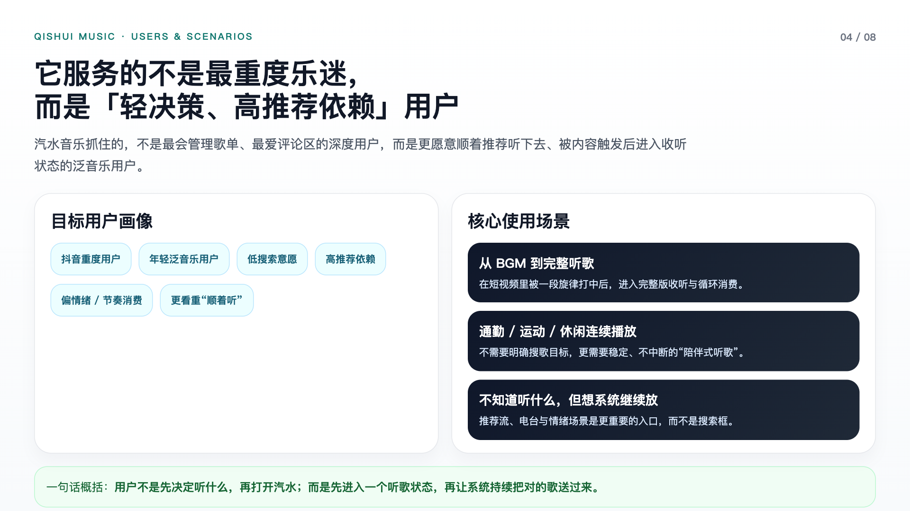
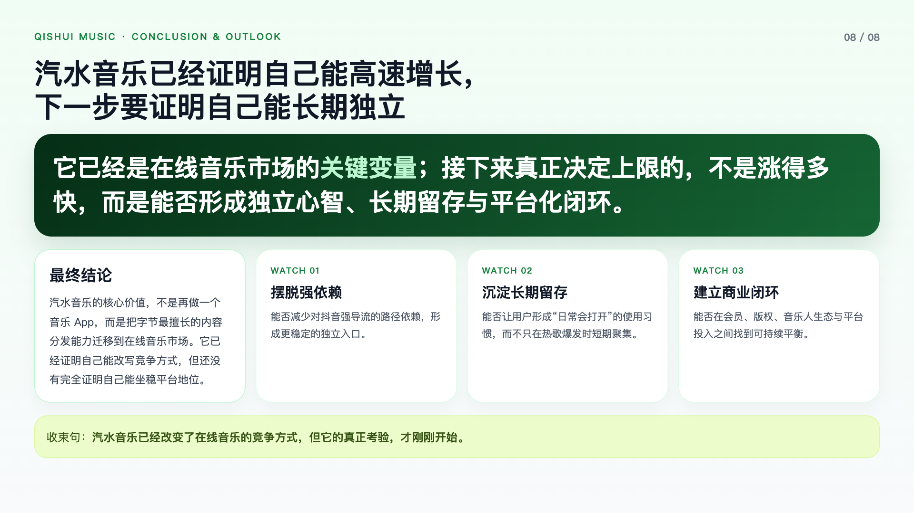

# ppt-agent-workflow-san

调研汽水音乐，经过简单的与agent几次对话，生成的ppt效果图。暂未实现svg生成的逻辑。

## 效果图

### 01 Cover

### 02 Core Conclusion

### 03 Positioning

### 04 Users Scenarios

### 05 Growth Flywheel

### 06 Competition

### 07 Risks

### 08 Conclusion

